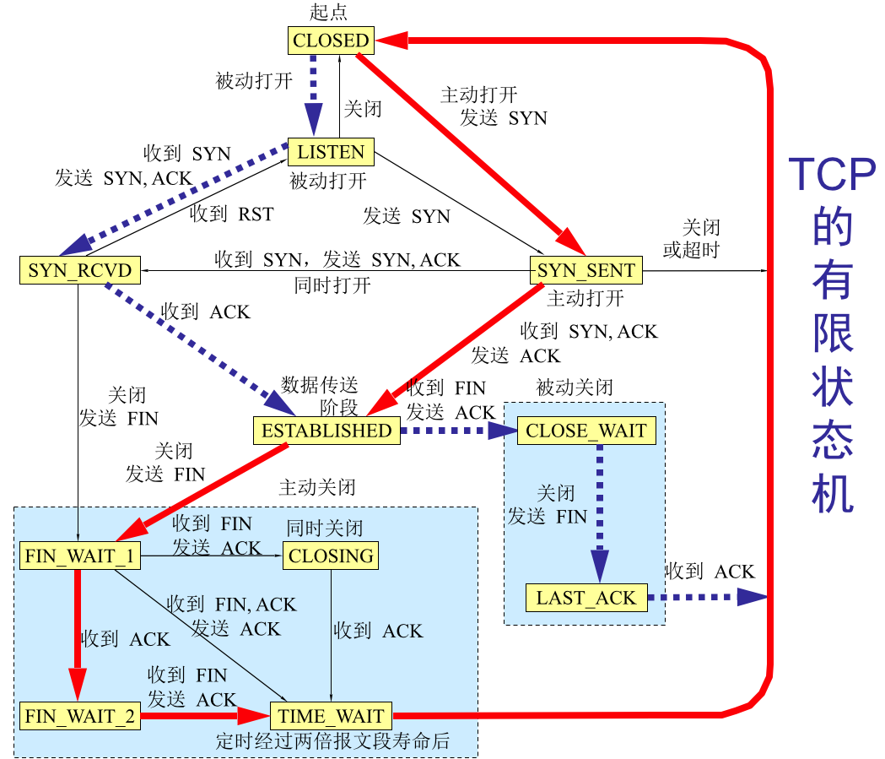

#状态迁移图

#time_wait
主动发送关闭请求的一方会进入到time_wait状态

    步骤: 
        1. A发送FIN给B,A从ESTABLISHED进入FIN_WAIT_1
        2. B收到FIN，B发送ACK,B从ESTABLISTHED进入CLOSE_WAIT
        3. A收到ACK,A从FIN_WAIT_1进入FIN_WAIT_2
        4. B发送FIN给A,B从CLOSE_WAIT进入LAST_ACK
        5. A收到FIN，A发送ACK,A从FIN_WAIT_2进入TIME_WAIT
在TIME_WAIT状态中一般要持续2MSL(1分钟)，
    
    目的是：
        1.根据超时重传递,确保A发送的最后一个ACK报文能到达B.
        2.确保旧连接的请求报文在网络失效。
   
   
 缺点：可能导致客户端的socket端口被用尽，无法再发起请求。

解决办法：
    1.可以改为长连接,但代价较大，长连接太多会导致服务器性能问题
    2.修改ipv4.ip_local_port_range，增大可用端口范围，但只能缓解问题，不能根本解决问题
    3.客户端程序中设置socket的SO_LINGER选项
    4.客户端机器打开tcp_tw_recycle和tcp_timestamps选项；
    5.客户端机器打开tcp_tw_reuse和tcp_timestamps选项；
    6.客户端机器设置tcp_max_tw_buckets为一个很小的值；
    7.开启套接字的SO_REUSEADDR(内核3.7之后)

知识补充：       
    **tcp_timestamp**是默认开启的一个tcp选项，本质是记录数据包的发送时间。  为了更精确的计算RTT(round trip time),步骤如下：
    1. 发送方在发送数据时，将一个timestamp(表示发送时间)放在包里面
    2. 接收方在收到数据包后，在对应的ACK包中将收到的timestamp返回给发送方(echo back)
    3. 发送发收到ACK包后，用当前时刻now - ACK包中的timestamp就能得到准确的RTT1.
   
在没有TCP_Timestamp的时候，SKB->when的方式计算RTT
    1. TCP层在发送出一个SKB时，使用skb->when记录发送出去的时间
    2. TCP层在收到SKB数据包的确认时，使用now - skb->when来计算RTT
    这时会存在一个缺陷，如当进行如下操作：
    1、tcp层首次发送SKB时间是send_time1，然后丢包发生重传，重传一个数据包的时间是send_time2
    2、tcp层收到SKB的确认包的时间是recv_time
    这样无法判断recv_time对应ACK是确认第一次数据包的发送还是确认第二次重传的数据包

tcp_timestamp缺点：
    增加了10个字节的TCP 开销

**tcp_tw_recycle**
    表示开启TCP连接中TIME-WAIT sockets的快速回收，默认为0，表示关闭。对客户端和服务器同时起作用，开启后在 3.5*RTO 内回收，RTO 200ms~ 120s 具体时间视网络状况。

    RTO就是tcp在发送一个数据包之后，会启动一个重传定时器，而RTO就是这个定时器的重传时间。
    在通俗的讲就是，我一开始预先算个定时器时间，如果你回复了ack那正好，如果没有回复给我ack，
    然后RTO定时器的时间又到了，那么我就重传。

如果同时开启tcp_tw_recycle和tcp_timestamp，那么会启动tcp/ip协议栈的per-host的PAWS机制。

    per-host的paws机制 
    在高带宽下，TCP序列号可能在较短的时间内就被重复使用(recycle/wrapped)，就可能导致同一条TCP流在短时间内出现序号一样的两个合法的数据包及其确认包！
    PAWS机制就是为了应对这一现象设计的，这种机制要求所有来个同一个host IP的TCP数据包的
    timestamp值是递增的。当收到一个timestamp值，小于服务端记录的对应值后，则会认为这是一个过期的数据包，然后会将其丢弃。
如果在NAT中，经过同一个NAT转换后的来着不同客户端的数据流，在服务器端都被认为是和同一个host打交道，因为每个client带有不同的timestamp,无法保证不同的clinet的数据包中的timestamp递增，不符合的只能丢弃。

**tcp_tw_reuse**
复用TIME_WAIT连接 只对客户端起作用,1秒后才能复用，当创建新连接的时候，如果可能的话会考虑复用相应的TIME_WAIT连接。通常认为tcp_tw_reuse比tcp_tw_recycle安全一些，这是因为一来TIME_WAIT创建时间必须超过一秒才可能会被复用；二来只有连接的时间戳是递增的时候才会被复用

#close_wait
被动发送关闭请求的一方会进入到close_wait状态   
    步骤: 
       1. A发送FIN给B,A从ESTABLISHED进入FIN_WAIT_1
       2. B收到FIN，B发送ACK,B从ESTABLISTHED进入CLOSE_WAIT 

##原因
被动关闭的一发没有发送FIN包。可能的情况有：
1. 程序忘记了
2. 可能是程序相应太慢了，一直处于耗时的逻辑操作，使得close延后了。
3. backlog设置过大，此处的 backlog 不是 syn backlog，而是 accept 的 backlog，如果 backlog 太大的话，设想突然遭遇大访问量的话，即便响应速度不慢，也可能出现来不及消费的情况，导致多余的请求还在队列里就被对方关闭了
##危害:
CLOSE_WAIT不会自己消失,这意味着一直占用服务器资源，端口数总的65535，一旦用完就只能干着急

