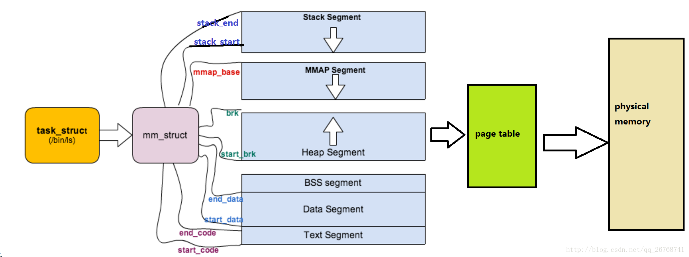

#mm_struct
描述进程的虚拟内存空间

```c
struct task_struct{
    struct mm_struct *mm,*active_mm;
}

```
>mm成员是用户空间描述符
>active_mm是进程运行时候使用的运行时描述符

**对于普通进程，这两个对象的值一样**
**对于内核线程，mm始终为null，active_mm为前一个进程的active_mm**

**所谓的线程就是共享同一个mm_struct的进程**

```c
struct mm_struct{
   void stack_end;
   void stack_start;
   void mmap_base;
   void brk;
   void start_brk;
   void end_data;
   void start_data;
   void end_code;
   void start_code;
};
```



```c
struct mm_struct{
    struct vm_area_struct*mmap,
    struct rb_root mm_rb;
};

```

```c
struct mm_struct{
    void mm_users;
    void mm_count;
}
```

```c
struct mm_struct{
    void mm_cache;
};
```