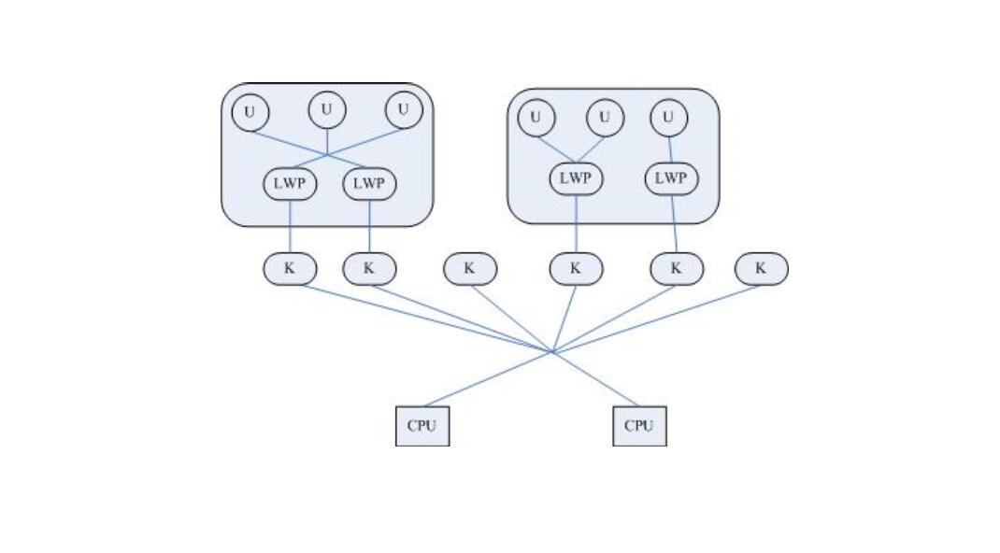
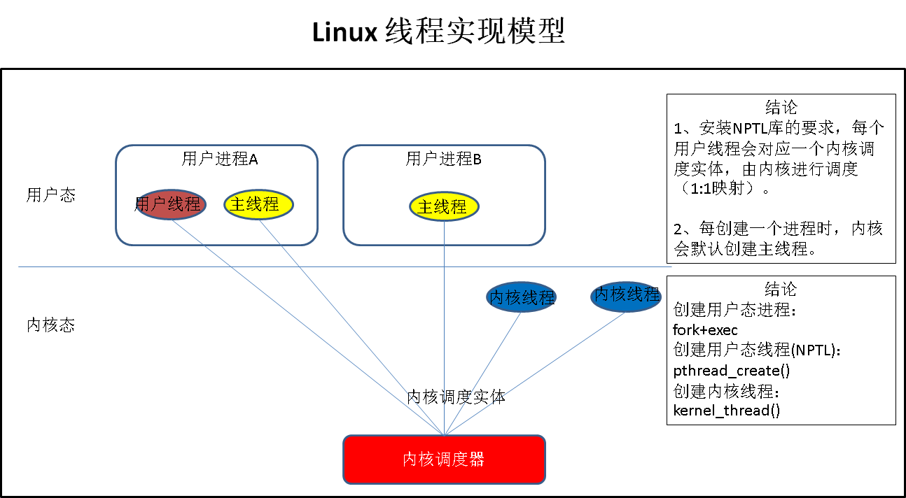

#内核线程
内核线程类似内核的分身,一个内核线程可以处理一个事情,内核线程的使用是
廉价的,唯一使用的资源就是内核栈和上下文切换的保存寄存器的空间,支持多线程的内核叫做多线程内核

#轻量级进程 LWP
轻量级进程是一种用内核支持的用户线程，它是内核线程的高级抽象，只有先支持了内核线程，才能支持LWP。每一个进程有一个或多个LWP。这种模型其实就是恐龙书上说的一对一模型，在这种实现的操作系统中，LWP就是用户线程。

每一个LWP和一个具体的内核线程关联，因此每一个LWP都是一个独立的线程调度单元。即使一个LWP阻塞也不会影响整个进程的执行。

LWP的缺点：大多数LWP的操作，如建立，析构，同步都需要进行系统调用，在用户 mode和内核mode切换代价高。另外每一个LWP都需要一个内核线程支持，因此LWP需消耗内核资源(内核线程的栈空间),所以没法创建大量LWP。

 将之称为轻量级进程的原因可能是：在内核线程的支持下，LWP是独立的调度单元，就像普通的进程一样。所以LWP的最大特点还是每个LWP都有一个内核线程支持。

#用户线程
LWP虽然本质上是用户线程，但是LWP线程是建立在内核之上的LWP的许多操作都要进行系统调用，因此效率不高。这里的用户线程是完全建立在用户空间的线程，用户线程的创建，同步，销毁，调度，完全是在用户空间完成的，内核并不知道，对内核来讲还是只调度了一个进程。这就是恐龙书上说的多对一线程模型
缺点:一个线程阻塞在系统调用中，则整个进程中所有线程阻塞。

#加强版用户线程----用户线程+LWP
这种模型就是恐龙书上说的多对多模型，用户线程还是完全建立在用户空间中，因此线程的操作还是很廉价，所以可以创建大量线程，操作系统提供了LWP作为用户线程和内核线程之间的桥梁。LWP还是和之前一样，具有内核线程的支持， 是内核调度的单元。并且用户线程的系统调用都要通过LWP，因此系统中某个用户线程的阻塞不会使得所有用户线程阻塞。用户线程库将建立的用户线程关联到LWP上，LWP与用户线程数量不一定一致。 当内核调度到某个LWP上，与该LWP关联的用户线程就被执行。

##Linux线程模型-2.6之前
以下内容主要参考“杨沙洲 (mailto:pubb@163.net?subject=Linux 线程实现机制分析&cc=pubb@163.net)国防科技大学计算机学院”的“Linux 线程实现机制分析”。

linux 2.6以前, pthread线程库对应的实现是一个名叫linuxthreads的lib.这种实现本质上是一种LWP的实现方式，即通过轻量级进程来模拟线程，内核并不知道有线程这个概念，在内核看来，都是进程。

Linux采用的“一对一”的线程模型，即一个LWP对应一个线程。这个模型最大的好处是线程调度由内核完成了，而其他线程操作（同步、取消）等都是核外的线程库函数完成的。

linux上的线程就是基于轻量级进程, 由用户态的pthread库实现的.使用pthread以后, 在用户看来, 每一个 task_struct就对应一个线程, 而一组线程以及它们所共同引用的一组资源就是一个进程.但是, 一组线程并不仅仅是引用同一组资源就够了, 它 们还必须被视为一个整体.

对此, POSIX标准提出了如下要求:

1, 查看进程列表的时候, 相关的一组task_struct应当被展现为列表中的一个节点;

2, 发送给这个"进程"的信号(对应kill系统调用), 将被对应的这一组task_struct所共享, 并且被其中的任意一个"线程"处理;

3, 发送给某个"线程"的信号(对应pthread_kill), 将只被对应的一个task_struct接收, 并且由它自己来处理;

4, 当"进程"被停止或继续时(对应SIGSTOP/SIGCONT信号), 对应的这一组task_struct状态将改变;

5, 当"进程"收到一个致命信号(比如由于段错误收到SIGSEGV信号), 对应的这一组task_struct将全部退出;

6, 等等(以上可能不够全);

在LinuxThreads中，专门为每一个进程构造了一个管理线程，负责处理线程相关的管理工作。当进程第一次调用 pthread_create()创建一个线程的时候就会创建并启动管理线程。然后管理线程再来创建用户请求的线程。也就是说，用户在调用 pthread_create后，先是创建了管理线程，再由管理线程创建了用户的线程。

linuxthreads利用前面提到的轻量级进程来实现线程, 但是对于POSIX提出的那些要求, linuxthreads除了第5点以外, 都没有实现(实际上是无能为力):

1, 如果运行了A程序, A程序创建了10个线程, 那么在shell下执行ps命令时将看到11个A进程, 而不是1个(注意, 也不是10个, 下面会解释);

2, 不管是kill还是pthread_kill, 信号只能被一个对应的线程所接收;

3, SIGSTOP/SIGCONT信号只对一个线程起作用;

还好linuxthreads实现了第5点, 我认为这一点是最重要的. 如果某个线程"挂"了, 整个进程还在若无其事地运行着, 可能会出现很 多的不一致状态. 进程将不是一个整体, 而线程也不能称为线程. 或许这也是为什么linuxthreads虽然与POSIX的要求差距甚远, 却能够 存在, 并且还被使用了好几年的原因吧~

但是, linuxthreads为了实现这个"第5点", 还是付出了很多代价, 并且创造了linuxthreads本身的一大性能瓶颈.

接下来要说说, 为什么A程序创建了10个线程, 但是ps时却会出现11个A进程了. 因为linuxthreads自动创建了一个管理线程. 上面提到的"第5点"就是靠管理线程来实现的.

当程序开始运行时, 并没有管理线程存在(因为尽管程序已经链接了pthread库, 但是未必会使用多线程).

程序第一次调用pthread_create时, linuxthreads发现管理线程不存在, 于是创建这个管理线程. 这个管理线程是进程中的第一个线程(主线程)的儿子.

然后在pthread_create中, 会通过pipe向管理线程发送一个命令, 告诉它创建线程. 即是说, 除主线程外, 所有的线程都是由管理线程来创建的, 管理线程是它们的父亲.

于是, 当任何一个子线程退出时, 管理线程将收到SIGUSER1信号(这是在通过clone创建子线程时指定的). 管理线程在对应的sig_handler中会判断子线程是否正常退出, 如果不是, 则杀死所有线程, 然后自杀.

那么, 主线程怎么办呢? 主线程是管理线程的父亲, 其退出时并不会给管理线程发信号. 于是, 在管理线程的主循环中通过getppid检查父 进程的ID号, 如果ID号是1, 说明父亲已经退出, 并把自己托管给了init进程(1号进程). 这时候, 管理线程也会杀掉所有子线程, 然后自 杀.

可见, 线程的创建与销毁都是通过管理线程来完成的, 于是管理线程就成了linuxthreads的一个性能瓶颈.

创建与销毁需要一次进程间通信, 一次上下文切换之后才能被管理线程执行, 并且多个请求会被管理线程串行地执行.

这种通过LWP的方式来模拟线程的实现看起来还是比较巧妙的，但也存在一些比较严重的问题：

1）线程ID和进程ID的问题

按照POSIX的定义，同一进程的所有的线程应该共享同一个进程和父进程ID，而Linux的这种LWP方式显然不能满足这一点。

2）信号处理问题

异步信号是以进程为单位分发的，而Linux的线程本质上每个都是一个进程，且没有进程组的概念，所以某些缺省信号难以做到对所有线程有效，例如SIGSTOP和SIGCONT，就无法将整个进程挂起，而只能将某个线程挂起。

3）线程总数问题

LinuxThreads将每个进程的线程最大数目定义为1024，但实际上这个数值还受到整个系统的总进程数限制，这又是由于线程其实是核心进程。

4)管理线程问题

管理线程容易成为瓶颈，这是这种结构的通病；同时，管理线程又负责用户线程的清理工作，因此，尽管管理线程已经屏蔽了大部分的信号，但一旦管理线程死亡，用户线程就不得不手工清理了，而且用户线程并不知道管理线程的状态，之后的线程创建等请求将无人处理。

5)同步问题

LinuxThreads中的线程同步很大程度上是建立在信号基础上的，这种通过内核复杂的信号处理机制的同步方式，效率一直是个问题。

6）其他POSIX兼容性问题

Linux中很多系统调用，按照语义都是与进程相关的，比如nice、setuid、setrlimit等，在目前的LinuxThreads中，这些调用都仅仅影响调用者线程。

7）实时性问题

线程的引入有一定的实时性考虑，但LinuxThreads暂时不支持，比如调度选项，目前还没有实现。不仅LinuxThreads如此，标准的Linux在实时性上考虑都很少

#Linux线程模型--NPTL
到了linux 2.6, glibc中有了一种新的pthread线程库--NPTL(Native POSIX Threading Library).

本质上来说，NPTL还是一个LWP的实现机制，但相对原有LinuxThreads来说，做了很多的改进。下面我们看一下NPTL如何解决原有LinuxThreads实现机制的缺陷

NPTL实现了前面提到的POSIX的全部5点要求. 但是, 实际上, 与其说是NPTL实现了, 不如说是linux内核实现了.

在linux 2.6中, 内核有了线程组的概念, task_struct结构中增加了一个tgid(thread group id)字段.

如果这个task是一个"主线程", 则它的tgid等于pid, 否则tgid等于进程的pid(即主线程的pid).

在clone系统调用中, 传递CLONE_THREAD参数就可以把新进程的tgid设置为父进程的tgid(否则新进程的tgid会设为其自身的pid).

类似的XXid在task_struct中还有两 个：task->signal->pgid保存进程组的打头进程的pid、task->signal->session保存会话 打头进程的pid。通过这两个id来关联进程组和会话。

有了tgid, 内核或相关的shell程序就知道某个tast_struct是代表一个进程还是代表一个线程, 也就知道在什么时候该展现它们, 什么时候不该展现(比如在ps的时候, 线程就不要展现了).

而getpid(获取进程ID)系统调用返回的也是tast_struct中的tgid, 而tast_struct中的pid则由gettid系统调用来返回.

在执行ps命令的时候不展现子线程，也是有一些问题的。比如程序a.out运行时，创建 了一个线程。假设主线程的pid是10001、子线程是 10002（它们的tgid都是10001）。这时如果你kill 10002，是可以把10001和10002这两个线程一起杀死的，尽管执行ps命令的时候根本看不到10002这个进程。如果你不知道linux线程 背 后的故事，肯定会觉得遇到灵异事件了。

为了应付"发送给进程的信号"和"发送给线程的信号", task_struct里面维护了两套signal_pending, 一套是线程组共享的, 一套是线程独有的.

通过kill发送的信号被放在线程组共享的signal_pending中, 可以由任意一个线程来处理; 通过pthread_kill发送的信 号(pthread_kill是pthread库的接口, 对应的系统调用中tkill)被放在线程独有的signal_pending中, 只能由本线 程来处理.

当线程停止/继续, 或者是收到一个致命信号时, 内核会将处理动作施加到整个线程组中.

